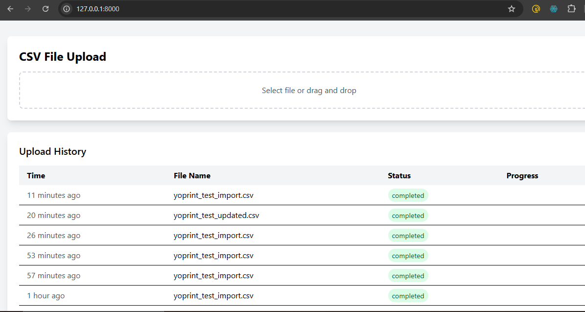
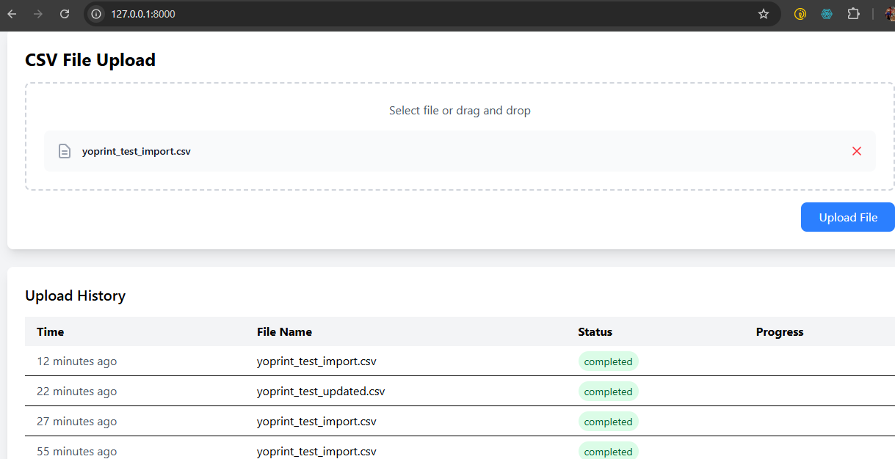
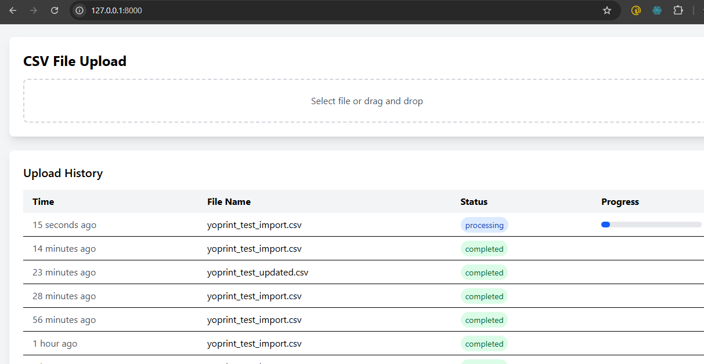

# YoPrint Laravel Coding Project

This is a Laravel-based CSV file processing application that provides robust file upload capabilities with background processing. The application features:

- CSV file upload handling with UTF-8 character validation and cleaning
- Background processing using Laravel's queue system with Redis
- Real-time status updates for file processing progress
- Idempotent file processing to prevent duplicate entries
- Efficient handling of large CSV files through queued jobs
- User-friendly interface for file upload and status monitoring

## Screenshots

### Project Overview

### File Selection Interface

### Progress Tracking

## Video Demonstration
Check out the video demonstration of the application in action:
[Watch Demo Video](recording.mp4)
<video src='recording.mp4' width=1000/>
## How to use
- Clone the repository with git clone
- Copy .env.example file to .env and edit database credentials there
- Run composer install
- Run php artisan key:generate
- Run php artisan migrate
- Run php artisan serve
- Run php artisan queue:listen or queue:work
- Run npm install & npm run dev
- That's it: launch the main URL
